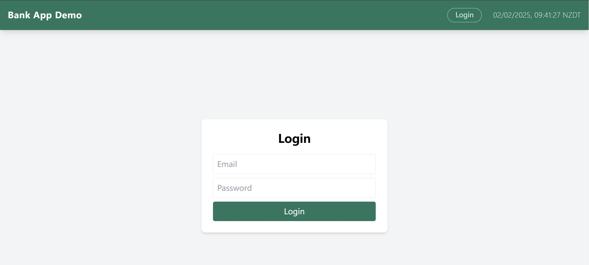
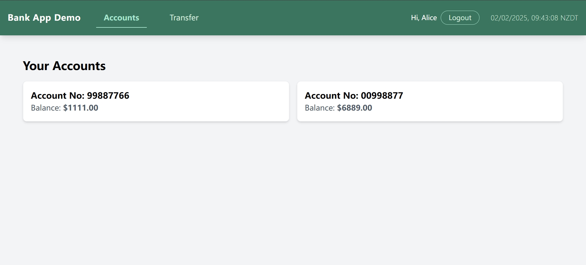
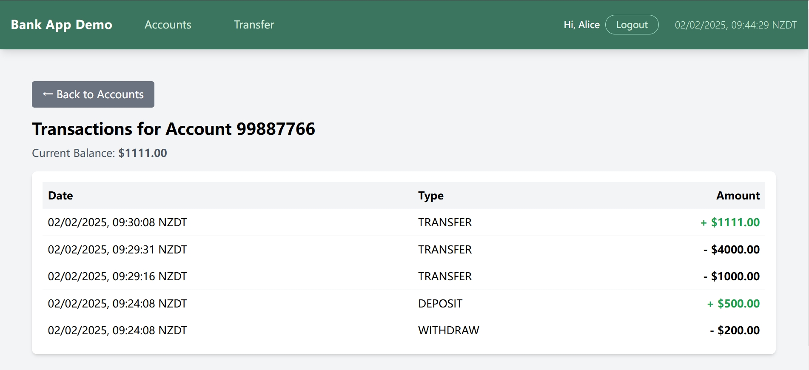
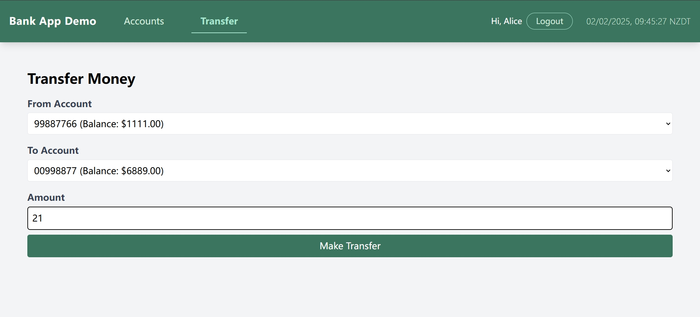

# **Bank App Demo**

## 1. Overview

This is a demo banking application built using **Spring Boot (backend)** and **React (frontend)**. The application allows users to:

- View all their accounts
- View transaction history for an account
- Transfer money between their own accounts
- Login & Logout functionality
---
## 2. Technologies Used

### Backend:

- **Java** – Primary programming language

- **Spring Boot** – RESTful API implementation

- **Spring Data JPA** – ORM for database operations

- **MySQL** – Database

- **Spring Security** – Basic authentication

- **Maven** – Build management

### Frontend:

- **JavaScript** – Primary programming language
- **React** – UI framework
- **Vite** – Build tool for fast development
- **HTML, Tailwind CSS** – UI & styling

---
## 3. Setup & Installation

### Project Structure

- The backend code is located in the `backend/` directory.
- The frontend code is located in the `frontend/` directory.

### Database Setup

- **MySQL configuration**: Update your MySQL credentials in `application.properties`:
  ```properties
  spring.datasource.url=jdbc:mysql://localhost:3306/bank_app?allowPublicKeyRetrieval=true&useSSL=false&serverTimezone=UTC
  spring.datasource.username=root
  spring.datasource.password=your_password
  ```
- The backend will **automatically initialize the database** using `schema.sql`.

### Run the Backend

By default, the backend runs at **[http://localhost:8080](http://localhost:8080)**.

### Run the Frontend

```bash
cd frontend
npm install
npm run dev
```

By default, the frontend runs at **[http://localhost:5173](http://localhost:5173)**.


---
## 4. API Endpoints


| Method | Endpoint           | Description |
| ------ | ------------------ | ----------- |
| POST   | `/api/auth/login`  | User login  |
| GET    | `/api/accounts?customerId={customerId}` | Get all user accounts |
| GET    | `/api/transactions?accountId={accountId}` | Get transactions for an account |
| POST   | `/api/transfers`                          | Transfer money between accounts |

---
## 5. Demo Screenshots

### Login Page
The application includes a login page where users must authenticate before accessing their accounts.



### Account Overview
After logging in, users can view all their bank accounts.



### Transaction History
Users can select an account to view recent transactions.



### Money Transfer
Users can transfer money between their own accounts.



---

## 6. Test Users

For testing purposes, the database is pre-populated with the following user accounts:

| Email             | Password | 
| ----------------- | -------- | 
| alice@example.com | 123456   |
| bob@example.com   | 123456   | 

You can log in using these credentials to test the application.
- **Alice (`alice@example.com`) has two accounts**, allowing transfers between her own accounts.
- **Bob (`bob@example.com`) has only one account**, so he cannot make transfers.
